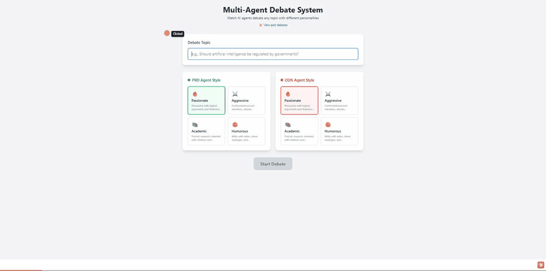

[](https://github.com/AlonNaor22/multi-agent-debate-system/actions/workflows/ci.yml)

# Multi-Agent Debate System

A multi-agent system where AI agents powered by Claude debate any topic. Features a React web UI with real-time streaming, audience voting, and argument scoring.

## Demo

<!-- TODO: record a short clip — start a debate (responses stream in live) →
     vote between rounds → final scoreboard — export it as docs/demo.gif, and
     uncomment the image line below. See docs/README.md. -->
<!--  -->

> Pro, Con, and a Judge agent debate a topic you choose — responses stream in token-by-token, you vote on who's winning between rounds, and the judge returns a structured scoreboard.

## Quick Start

### Prerequisites
- Python 3.11+
- Node.js 20+
- Anthropic API key

### 1. Clone and setup
```bash
git clone https://github.com/AlonNaor22/multi-agent-debate-system.git
cd multi-agent-debate-system

# Create virtual environment
python -m venv venv
venv\Scripts\activate        # Windows
source venv/bin/activate     # macOS/Linux

# Install Python dependencies
pip install -r requirements.txt

# Install frontend dependencies
cd frontend
npm install
cd ..
```

### 2. Configure API key
Create a `.env` file in the root directory:
```
ANTHROPIC_API_KEY=your-api-key-here
```

### 3. Run the app
Open two terminals:

**Terminal 1 - Backend:**
```bash
uvicorn api.main:app --reload
```

**Terminal 2 - Frontend:**
```bash
cd frontend
npm run dev
```

### 4. Open the app
Go to **http://localhost:5173** in your browser.

---

## Docker

Run the full stack (backend + frontend) with one command:

```bash
docker compose up --build
```

- Open http://localhost:5173 in your browser once both services start.
- Make sure your .env file exists with ANTHROPIC_API_KEY set before running.
- The backend API is available at http://localhost:8000.
- Persisted debates live in the SQLite database under the `debate-data` volume, so they survive container restarts and rebuilds.

---

## How It Works

The system uses LangChain to orchestrate three separate Claude instances, each with a distinct persona:

- **Pro Agent** — Argues in favor of the topic
- **Con Agent** — Argues against the topic
- **Judge/Moderator** — Evaluates arguments and declares a winner

### Debate Flow

```
Introduction → Opening Statements → Rebuttals → Audience Vote → Closing Statements → Verdict → Scoring
```

Messages stream in real-time like ChatGPT, and you can vote on who's winning mid-debate.

## Architecture

The debate is a **state machine driven by one shared engine**. The phase
sequence and the per-turn instructions live in exactly one place —
[src/debate_engine.py](src/debate_engine.py) — and two different front-ends
consume it: a synchronous terminal CLI and an async, streaming web service.
Because both read the *same* ordered event stream, the two experiences can't
quietly drift apart.

### One engine, two consumers

`DebateEngine.events()` is a pure generator: it yields ordered events and never
calls the LLM, prints, awaits, or mutates state. Each consumer decides *how* to
execute each event.

```
   DebateEngine.events()        src/debate_engine.py — a pure generator,
        │                       the single source of truth for the flow.
        │   yields an ordered stream of:  PhaseChange · Turn · Vote · Score
        │
        ├──▶ DebateController   (CLI · synchronous)
        │       runs each Turn with agent.respond(); renders with Rich
        │
        └──▶ DebateService      (web · async + streaming)
                runs each Turn with agent.astream_respond(); streams the
                tokens out over the WebSocket

   Both drive the same three agents:

   Pro · Con · Judge  —  each a DebateAgent (its own ChatAnthropic instance,
        │                 temperature, and system persona; no stored history)
        │
        └─ handed the FULL shared transcript (DebateState.transcript) on every
           turn — that is the only way each agent "sees" and rebuts the others
```

- **The three agents** ([src/agents/base_agent.py](src/agents/base_agent.py))
  are built once by `build_agents(pro_style, con_style)`; each is an independent
  `DebateAgent` wrapping its own `ChatAnthropic` chain (`prompt | llm`).
- **Context passing is the shared transcript.** `DebateState` — subclassed by
  both `DebateController` (CLI) and the web `DebateSession` — owns the running
  transcript and the current phase. Handing the *entire* transcript to each
  agent every turn is also what makes [prompt caching](#prompt-caching) pay off:
  it's an append-only prefix.

### Phase state machine

The engine walks a fixed `DebatePhase` sequence
([src/debate_enums.py](src/debate_enums.py)), emitting a `PhaseChange` at each
step so the web progress bar and the CLI stay in lock-step:

```
introduction → opening_pro → opening_con → rebuttal ×N → (audience vote)
   → closing_pro → closing_con → verdict → scoring → finished
```

The rebuttal round count is `NUM_REBUTTAL_ROUNDS` (config/env). The audience
vote is recorded mid-rebuttal: on the web it's collected over the socket with a
timeout that defaults to a tie; in the CLI it's an `input()` prompt.

### WebSocket streaming pipeline

On the web path, each agent turn is streamed token-by-token, end to end:

```
DebateAgent.astream_respond            async generator over chain.astream
      │  text chunks
      ▼
DebateService._stream_agent_response   emits:  message_start →
      │                                        message_chunk × N →
      │                                        message_complete
      ▼
api/routes/websocket.py                serialises each event to JSON
      │  WebSocket frames
      ▼
App.tsx · handleWSMessage  →  Zustand store
      │  startStreaming / appendStreamingChunk / finishStreaming
      ▼
DebateChat renders the tokens as they arrive
```

The judge's verdict streams the same way, but **scoring is structured, not
streamed**: the `Score` event calls `ascore_arguments`, which uses Anthropic
structured outputs (`with_structured_output`) to return a typed `DebateScores`
([src/scoring.py](src/scoring.py)). The web emits it as an `argument_scores`
event that the React `Scoreboard` renders as per-argument bars, side averages,
and a winner.

### Failure handling

Every LLM call is wrapped: a transient `anthropic.AnthropicError` becomes a
domain-specific `AgentError`. The CLI catches it and prints a friendly message;
the web layer logs the detail server-side, sends the browser a generic `error`
event (never a raw traceback), and evicts the in-memory session.

### Prompt Caching

Every turn re-sends a large, near-identical prompt: the agent's fixed persona **plus the entire debate transcript so far**. Rather than pay full price to reprocess that prefix on every call, the system applies [Anthropic prompt caching](https://docs.anthropic.com/en/docs/build-with-claude/prompt-caching) — a `cache_control` breakpoint sits after the persona and another after the transcript, with the short, volatile per-turn instruction placed deliberately **after** both. Because the transcript only ever grows by appending, each turn's prefix is an exact extension of the previous one, so from the second turn on Claude serves the cached persona + prior transcript at ~10% of the input-token cost (and with lower latency) instead of reprocessing the whole history.

It's verified at runtime from each response's usage metadata: `DebateAgent` logs the `cache_read` / `cache_creation` token counts per turn (see `_log_cache_usage` in [src/agents/base_agent.py](src/agents/base_agent.py)) — after the opening turn, `cache_read` is non-zero while the uncached input stays small.

### Persistence

Completed debates are saved to a small SQLite database (via SQLAlchemy) so they survive a server restart. The live, in-flight debate still runs from an in-memory session — it holds the audience-vote event and the agent objects, which aren't serialisable — and when it finishes, the topic, full transcript, and scoreboard are written to the DB ([api/db.py](api/db.py), [api/models.py](api/models.py), [api/services/debate_repository.py](api/services/debate_repository.py)). A **Past Debates** view in the React app lists previous debates (`GET /api/debates`) and opens any one in full (`GET /api/debates/{id}`), reusing the same message and scoreboard components as the live view.

## Features

- **Web UI** — React frontend with chat-style interface
- **Live streaming** — Watch responses appear character-by-character
- **Multiple personality styles** — Passionate, Aggressive, Academic, or Humorous
- **Audience voting** — Vote on who's winning between rounds
- **Argument scoring** — Judge scores each individual argument
- **Past debates** — Completed debates persist to SQLite and can be browsed and reopened
- **Color-coded speakers** — PRO (green), CON (red), Judge (yellow), Moderator (blue)

### Personality Styles

| Style | Description |
|-------|-------------|
| **Passionate** | Persuasive, uses rhetorical techniques, acknowledges opponents |
| **Aggressive** | Confrontational, attacks logic directly, never concedes |
| **Academic** | Formal, cites research and data, uses logical frameworks |
| **Humorous** | Witty, uses satire and analogies, entertains while persuading |

## Project Structure

```
├── api/                         # FastAPI backend
│   ├── main.py                  # API entry point
│   ├── db.py                    # SQLAlchemy engine/session + table init
│   ├── models.py                # Debate ORM model (SQLite)
│   ├── routes/
│   │   ├── debates.py           # REST endpoints (create + history)
│   │   └── websocket.py         # WebSocket streaming
│   ├── schemas/
│   │   └── debate.py            # Pydantic models
│   └── services/
│       ├── debate_service.py    # Streaming consumer of the debate engine
│       └── debate_repository.py # Read/write persisted debates
│
├── frontend/                    # React app
│   ├── src/
│   │   ├── App.tsx
│   │   ├── components/debate/   # UI components
│   │   ├── stores/              # Zustand state
│   │   ├── types/               # TypeScript types
│   │   └── constants/           # Centralized user-facing UI copy
│   └── package.json
│
├── src/                         # Core debate logic
│   ├── agents/
│   │   └── base_agent.py        # DebateAgent (ChatAnthropic + persona) + build_agents
│   ├── prompts.py               # Personality system prompts + turn instructions
│   ├── debate_enums.py          # DebatePhase / Speaker enums
│   ├── scoring.py               # DebateScores schema (structured judge output)
│   ├── debate_engine.py         # Shared debate flow + state (single source of truth)
│   └── debate_controller.py     # Synchronous CLI consumer of the engine
│
├── main.py                      # CLI entry point
├── config.py                    # Model settings
├── messages.py                  # Centralized user-facing copy (CLI + API)
└── requirements.txt
```

## Running Tests

```bash
pip install -r requirements-dev.txt
pytest tests/ -v
```

137 tests covering the debate engine and agents (including prompt caching), the web/streaming layer, persistence, prompt styles, config values, and API schemas — all run without hitting the Anthropic API.

The React frontend has its own suite (Vitest + Testing Library):

```bash
cd frontend
npm test
```

---

## CLI Mode (Alternative)

You can also run debates in the terminal without the web UI:

```bash
python main.py
```

## Technologies

- **Backend:** Python, FastAPI, LangChain, Anthropic Claude
- **Persistence:** SQLAlchemy + SQLite
- **Frontend:** React, TypeScript, Vite, TailwindCSS, Zustand
- **Real-time:** WebSocket streaming

## API Endpoints

| Endpoint | Method | Description |
|----------|--------|-------------|
| `/` | GET | API root / version info |
| `/health` | GET | Health check (returns `{"status":"healthy"}`) |
| `/api/debates` | POST | Create a new debate |
| `/api/debates` | GET | List completed (persisted) debates |
| `/api/debates/{id}` | GET | Fetch one completed debate in full (transcript + scores) |
| `/api/config/styles` | GET | Get available personality styles |
| `/ws/debates/{id}` | WS | WebSocket for real-time streaming |
